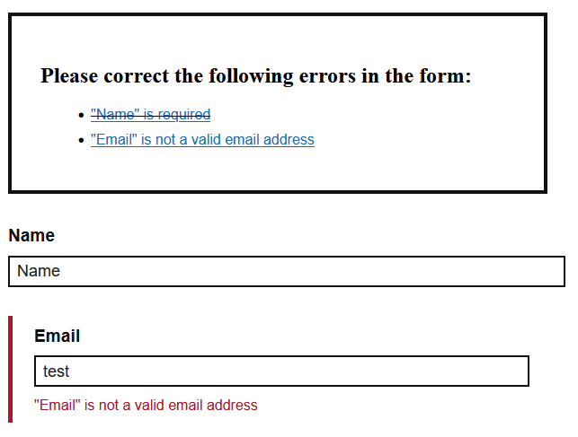

# mindscreen Accessible Form Validation

[](https://www.npmjs.com/package/@mindscreen/formvalidation)

This package implements an accessible form validation.

## Core features
* Fields are validated when leaving the input and error messages are displayed inline.
* When submitting the form, an error summary is displayed above the form
* Extensible validation and error rendering



## Usage
```bash
npm install @mindscreen/formvalidation
# or
yarn add @mindscreen/formvalidation
```

### Concepts
* The `Validation` describes how your form validation is supposed to work.
  It configures the validators used and how the errors should be handled.

* A `Validator` adheres to the `ValidatorInterface` and determines whether a form input is valid.
  In case of an error, it may provide an error message and additional arguments to provide information on the error (e.g. allowed vs. actual string length).

* The `ErrorHandler` will handle how the errors are displayed in your form.
  If not specified, the default error handler will be used.

* Finally, the `ValidationInstance` is this whole configuration applied for a single form element with `Validation.init(form, options)`.
  It provides an interface to trigger validation or clear validation errors, but also knows how to retrieve the elements in your form.
  This can be configured in the options to match your template.
  * An `InputGroup` usually is a (layout) container around a form element, its label and possibly its validation messages.
    They are accessed as `ValidationInstance.inputGroups` and are the cornerstone of input validation: all validation is based on these groups.
  * Inputs and their related content (like labels) is derived from the `InputGroup` (see `InputValidation.getInput`, `InputValidation.getLabel`).
  
  See the example templates for the HTML structure expected in the default options.

### Browser Validation
There is a `NativeValidator` using the browser APIs for form element validation.
It requires the least setup, as the browser will provide localized error messages.
Note however that these might not be in the language of your web page.

See [examples/nativeValidation.ts](./examples/nativeValidation.ts).

You can add additional validators, but **all applicable validators are evaluated**, i.e. you might get both native and custom validator handling.
You can of course extend the validator and override the applicability condition:

```ts
import { NativeValidator } from '@mindscreen/formvalidation/src/validation/validators';

const MyNativeValidator = {
    ...NativeValidator,
    isApplicable: input => NativeValidator.isApplicable(input)
        && !input.hasAttribute('data-custom-validation'),
};
```

### Custom Validation
See [examples/fromOptions.ts](./examples/fromOptions.ts) on how to completely set up your custom validation.

If you encode all translations and configuration in your markup, you can have a look at [src/default-setup.ts](./src/default-setup.ts), which provides a basic setup.

### Custom Validators
To allow for custom rules, you can implement custom validators.
See [examples/customValidator.ts](./examples/customValidator.ts).

## Build
### Build the examples
```bash
npm install
npm run examples
```

### Build the docs
```bash
npm install
npm run docs
```

### Build distribution code
```bash
npm install
npm run build
```
